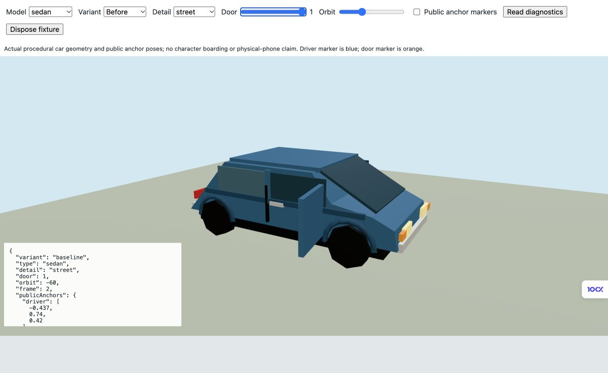
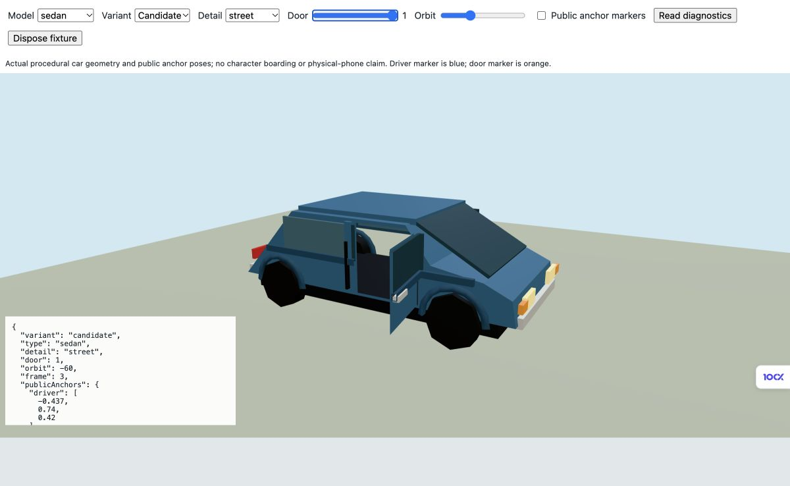

# Physical driver aperture — bounded graphics phase v2

Opening a road-car door previously moved a separate panel while the opaque body cap and window still filled the doorway. This phase partitions the authored driver-side cap, glass and trim into the actual hinged panel, retaining the opposite side, roof, hood, sill, wheels, lights and public driver/door/seat anchors. It uses construction-only polygon clipping; it adds no external asset, CSG dependency, draw layer or per-frame remeshing.

Source baseline: published driver-anchor phase50660a2f, model SHA256 `c341b3776e6d69482969c26948a1469cd82c3e954f03ef5f2e114d5e363a1b25`. Candidate model SHA256 `7db039a0b25373a86354639fd703a96aab3a3de48a3088c14c555cc0fa6afc19`; test `d4e2aa76826794ed96b4d0e1b9b47f0634ac949c5b8751f643db637777c30518`. The phase commit containing this report gives the exact reviewed source. Fresh main59983760 is merged in06f77bae with both dirty source hashes preserved. Main's production models have not adopted the earlier door phase; this branch includes it.

## Checks and measured geometry

Node22.19.0: frozen anchor-only model exits1 on the real obstructed doorway. Candidate complete vehicle suite **9/9, exit0**, including all vehicle/detail hard budgets, transformed public anchors, nine closed-filled/open-clear surface rays per road-car/detail, deterministic poses and idempotent resource disposal. Targeted source/test/viewer `vue-tsc --noEmit` exits0. Full-project compiler/build/download/CI are not claimed for this phase.

First candidate failed: cab/map342 triangles and a ray above the hatchback contour. Coplanar faces reduced342→290; retaining intact body perimeter faces reduced290→266. Cause: redundant map glass shells. Replacing six-faced map windows with two outward panes retains measured Y/Z silhouettes and reduces map triangles below the unchanged250 cap. The ray now samples1.20 inside every contour instead of1.25 above the hatchback slope; the frozen control still fails the intended obstruction. No budget was loosened.

| Style | Map before → after | Street before → after | Showcase before → after |
| --- | --- | --- | --- |
| sedan | 240 → 224 | 664 → 706 | 1048 → 1090 |
| hatchback | 236 → 214 | 660 → 688 | 1044 → 1072 |
| suv | 236 → 216 | 660 → 696 | 1044 → 1080 |
| cab | 248 → 234 | 696 → 754 | 1080 → 1138 |

Draw counts remain7 at map/street and8 at showcase. Independent frozen-source surface accounting conserves authored body+hinged surfaces, except separately measured map glass shell removal with exact pane area/silhouette witnesses. Geometry attributes/indices/instance bytes for the other11 builders ×3details are exact. [Full conservation receipt](graphics-evidence/driver-aperture-v2/panel-conservation.json), [Node receipt](graphics-evidence/driver-aperture-v2/test-report.json), [actual panel and anchor bounds](graphics-evidence/driver-aperture-v2/actual-panel-anchor-bounds.json).

## Actual browser review

Root inspected identical production-light sedan before/after open views, allfour street-style openings, a cab half-door sample, and closed/open map panes. Actual driver doorway is visible and the authored window/trim move with the panel. No console warnings/errors; fixture teardown reports0geometries/0textures. Frame counts include the floor and are not full driving-scene timing. A/B renderer caches both variants; cache counts are not one-model memory comparisons.

## Integration gates

This is a physical-surface correction, **not accepted complete boarding or visual-finish quality**. Thin panels, coarse windows/wheels, missing interior treatment and full canonical actor entry/sit/exit/roof/hand/foot contact remain. Sparse rays and panel AABBs do not certify a swept body envelope or a rectangular aperture. LIVING owns the controller and its next sit-exit trajectory correction; do not enlarge the roof, change character scale or invent a new clip to conceal contact failures.

User target: expressive warm3D with human proportions across the entire game. Modest measured growth is allowed conditional on mobile playability; no numeric cap changed. Source/runtime/download/build/whole-journey bytes, construction/frame/input timing, memory/thermal and real Android/iPhone gates remain unverified. Original baselines remain immutable. Evidence under docs is not a new runtime asset.

The preceding graphics-to-WORLD resource handback is historical. Current main599/30d57 assigns APP UI both verification and release until explicit terminal handoff; no graphics upload is authorized by the old receipt. Owned review tab1412593695 closed; Vite5514/browser71368 terminal130, last bounds job terminal0; all slots0/1 and port5184empty. Explicit intensive handoff sent toWORLD. No graphics upload or main integration.
