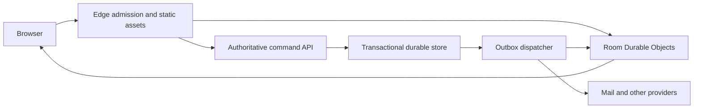

> Historical planning reference from the older checkout. Use `../DEPLOYMENT-HANDOFF.md` and `../RELIABILITY-IMPLEMENTATION.md` for current source, verification and cost constraints.

# Allworld reliability implementation handoff

Prepared 7 October 2026. Status: implementation in progress locally; not deployed. See [implementation evidence](./implementation-log.md) and [risk status](./status.json).

Current user constraint: implement every stage now using free tiers. Do not defer PostgreSQL or room partitioning for a later paid upgrade. Provision only verified Free-plan resources, with no paid add-ons or automatic upgrades. Reaching a quota must produce bounded refusal/degradation rather than overage spending. Provider connections and action-time security/terms approvals remain external gates, not reasons to stop independent implementation.

Integration correction: the live health label resolves to commit `4832b7e7507914db8a4d721a7f6e5d6ad21d91e1`, substantially newer than this checkout. The clean integrated-preview worktree is at `7823c998903c9066a7facc71bf9a377aa46e1805`. Newer source already has dirty attachment tracking, in-memory short-window limits, storage optimizations and release-update handling. The risk register is evidence about the original inspected checkout, not a current-live audit. Reconcile every finding against the approved integration target before porting. The earned-credit defect and bounded wallet-history gap were reconfirmed in the newer source.

## Start here

Read [the risk register](./risk-register.md), then implement [the work packages](./implementation.md) in dependency order. The register covers the Lagos Life article and additional failure modes found in Allworld. Every risk has an implementation owner package and a verification requirement.

The inspected checkout was `/Users/anthonyakpan/Desktop/JoinAllworld`, HEAD `f115424cab17535a063b406977927f1a5d2099c0`, with substantial pre-existing tracked and untracked changes. Source references include those changes, especially commerce. Recheck HEAD, status, deployed SHA, and referenced symbols before implementation. Preserve unrelated edits. A source finding does not establish that the same revision is deployed.

The article, [The Engineering Behind Lagos Life](https://africanengineer.com/i/lagos-life), was read in Anthony's signed-in local Chrome tab. It reports database overload, two migrations, application/database distance, abuse, operating costs, and exploited currency that spread between players. Its traffic and cost figures are interview/dashboard claims, not Allworld sizing inputs or independently verified benchmarks.

## Outcome

Keep acknowledged progress durable, bound overload, isolate busy rooms, trace every currency change, and recover without guessing which balances to erase. Publish a measured capacity envelope and an operational response for each limit. No architecture eliminates every bottleneck. Completion means each identified risk is either mitigated with evidence or remains explicitly blocked; a green build alone is insufficient.

## Current evidence

- All APIs and sockets route to one named Durable Object. World shards are subdivisions of that object's storage, not independent compute instances.
- The SQLite adapter uses serialized transactions and a durability barrier. Money and retry receipts commit together.
- Server-side transfer eligibility, integer validation, earned-money limits, and replay protection already exist. Preserve them.
- Five existing `src/game/systems/wallet.test.ts` checks passed during this review, including overflow rejection and 4,000 reconciled wallet changes. This is not a transfer, load, disaster-recovery, or production acceptance result.
- Infrastructure and economy source audits were delegated to Luna and Sol respectively. Architecture synthesis and source verification stayed with the primary agent. No production mutations, servers, builds, or new tests were performed for this handoff. Agent monetary cost and token usage were unavailable.
- Prior operational notes indicate observability and release work occurred elsewhere. Those notes were used only to identify verification needs. Current telemetry ingestion, quota, release configuration, and live safety remain unverified.

## Design decision

Use **room Durable Objects for ephemeral realtime state**, with a **transactional durable core** for identities, gameplay state, wallets, inventory, ownership, receipts, and an outbox. First improve the existing SQLite core. Then prepare a managed PostgreSQL adapter as the selected growth architecture, with deployment gated on measured demand, an approved provider/cost choice, and migration rehearsal.

| Candidate | Strength | Main cost | Decision |
| --- | --- | --- | --- |
| Keep one object and optimize | Smallest immediate change; preserves current atomicity | Still one queue and storage ceiling | Transitional only |
| Per-player/city objects own all durable state | Local writes and horizontal isolation | Transfers, trades, purchases and identity moves need distributed commit/escrow protocols | Do not adopt for money in this programme |
| Room objects plus PostgreSQL durable core | Isolates movement; retains database transactions across players and assets | Database operations, pooling, regional placement and migration | Selected growth design |

PostgreSQL is not an unlimited-capacity promise. Indexed access, short transactions, connection limits, hot-account controls, admission control, and measured headroom remain necessary. Do not move only the database to a distant provider and retain many sequential round trips. Do not copy the article's AWS migration merely because its author used AWS.

Room objects never mint money or decide ownership. Durable commits emit events through an outbox. A lost notification changes freshness, never correctness. During the first stage, `DB` remains the existing SQLite object. In the growth stage, core API requests use PostgreSQL directly rather than passing through the old singleton.

## Agent kickoff prompt

> Implement the Allworld reliability programme in `docs/reliability-2026-10-07/implementation.md`, starting with W0 and its evidence inventory. Read the risk register. Recheck the checkout and deployed revision; preserve unrelated dirty work. Use the existing technical-autopilot/model-routing instructions. Complete one work package and its required verification before dependent work. Record each risk as open, implemented locally, verified on staging, or verified in production, with artifact paths and exact revision. Keep all money-changing state and receipts atomic. Never mark a risk closed from a worker report or build alone. This document is a plan, not authorization to purchase services, change production, deploy, send messages, create branches/worktrees, or add tests. Obtain any missing authorization at the relevant boundary. Continue independent local work while an external gate is pending. Do not silently raise limits, reset players, or switch money authority during migration.

## Planning defaults to confirm before release

- Capacity tiers: 100, 500, 1,000, then 5,000 concurrent sessions; additionally a deliberately crowded single room. These are verification targets, not supported capacity claims.
- Initial staging gates: core commands p95 ≤500 ms and p99 ≤1.5 s; unexpected errors <0.1%; zero invariant violations; recovery from reconnect within 10 s for healthy clients. Record network origin and distinguish network latency from server time.
- Start room occupancy at 64 with deterministic overflow instances. Validate before increasing it. Offer friends an explicit same-instance join flow; never silently separate a party.
- Budget, provider region, retention duration, support coverage, and acceptable disaster RPO/RTO require named owner decisions in W0. The proposed recovery target is no acknowledged loss for application crashes and a rehearsed ≤30-minute restoration for the agreed disaster scope. Provider capabilities determine the actual disaster RPO.
- Load work runs only in an explicitly authorized disposable environment with a stop condition. Existing local Node load scripts are not evidence of Cloudflare Worker capacity.

## Primary technical references

- [Durable Object limits](https://developers.cloudflare.com/durable-objects/platform/limits/): individual objects are single-threaded; horizontal scale requires multiple objects. Published limits are not throughput guarantees.
- [SQLite storage and recovery](https://developers.cloudflare.com/durable-objects/api/sqlite-storage-api/): recovery API and storage semantics; verify the live object's restore evidence.
- [WebSocket hibernation](https://developers.cloudflare.com/durable-objects/best-practices/websockets/): attachment lifecycle for socket state.
- [Hyperdrive pooling](https://developers.cloudflare.com/hyperdrive/concepts/connection-pooling/) and [placement](https://developers.cloudflare.com/hyperdrive/concepts/how-hyperdrive-works/): transaction pooling and application/data proximity.
- [Hyperdrive query caching](https://developers.cloudflare.com/hyperdrive/concepts/query-caching/): use a cache-disabled binding for authoritative reads, sessions and balances. Writes do not invalidate cached reads.
- [PostgreSQL transaction isolation](https://www.postgresql.org/docs/current/transaction-iso.html): choose isolation and retry whole transactions on serialization failures.

These sources were checked during this review. Recheck provider-specific limits when implementing.
